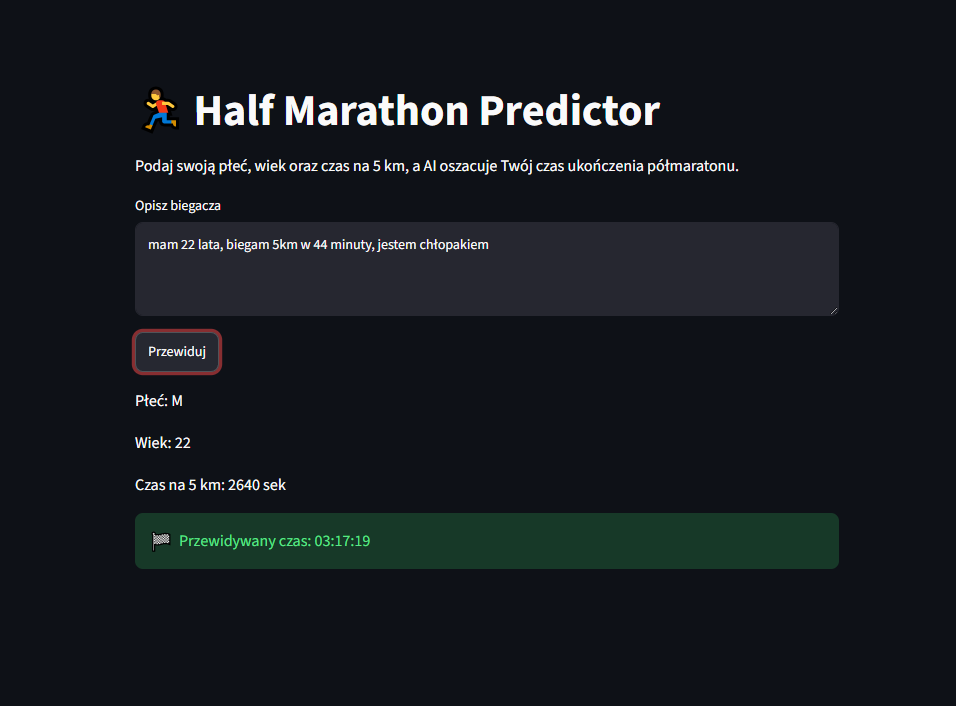
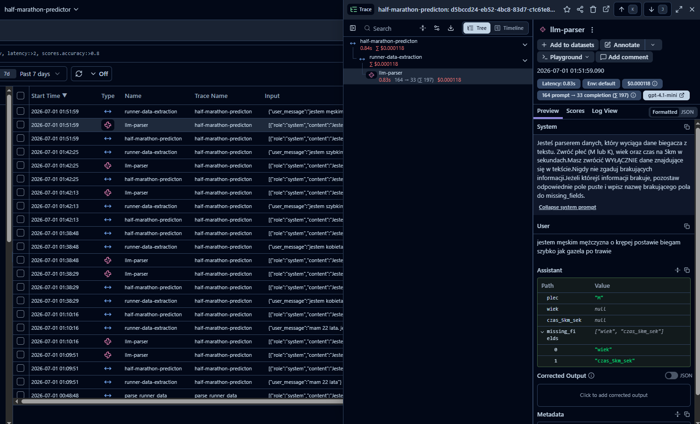

# 🏃 Half Marathon Predictor


AI-powered application that predicts half marathon finish time based on natural language input using a Machine Learning model and an LLM.

## 🌐 Live Demo

**Application:** https://halfmarathon-predictor-drxfd.ondigitalocean.app/

## 📷 Preview



## 📌 Project Overview

Half Marathon Predictor is an AI application that predicts a runner's half marathon finish time based on natural language input.

The application combines:

- Machine Learning for time prediction
- OpenAI GPT-4.1 Mini for extracting structured data from free text
- Langfuse for monitoring LLM calls
- DigitalOcean Spaces for model storage
- Streamlit as the user interface

## 🚀 Features

- Predict half marathon finish time
- Accept natural language input
- Extract runner data from natural language using GPT
- Validate missing information
- Download the trained model from DigitalOcean Spaces
- Monitor LLM calls with Langfuse
- Deployed on DigitalOcean App Platform

## 🛠 Tech Stack

- Python
- Pandas
- Streamlit
- Scikit-learn
- OpenAI API
- Instructor
- Pydantic
- Langfuse
- Boto3
- DigitalOcean Spaces
- DigitalOcean App Platform

## 🏗 Architecture

```
                User
                  │
                  ▼
        Streamlit Application
                  │
                  ▼
 OpenAI GPT-4.1 Mini + Instructor
                  │
                  ▼
  Structured Runner Information
                  │
                  ▼
Regression Model (DigitalOcean Spaces)
                  │
                  ▼
 Predicted Half Marathon Time
```

## 📁 Project Structure

```text
half_marathon_predictor/
│
├── app.py                  # Streamlit application
├── llm.py                  # LLM-based data extraction
├── predictor.py            # Loads the trained model
├── utils.py                # Prediction utilities
├── langfuse_client.py      # Langfuse configuration
├── requirements.txt
│
├── data/
│   ├── halfmarathon_wroclaw_2023_final.csv
│   └── halfmarathon_wroclaw_2024_final.csv
│
├── models/
│   └── halfmarathon_linear_regression.pkl
│
└── README.md
```

## ⚙️ How It Works

1. The user enters a natural language description.
2. GPT extracts:
   - gender
   - age
   - 5 km time
3. The application validates the extracted information.
4. The trained regression model predicts the half marathon finish time.
5. The prediction is displayed in the Streamlit interface.
6. Langfuse logs the LLM interaction for monitoring and evaluation.

## 💬 Example

### Input

> I am a 28-year-old male and my 5 km time is 22 minutes.

### Output

```
Predicted half marathon time:
01:43:58
```

### Missing Information

Input:

> I am a 28-year-old male.

Output:

```
Missing information:

- 5 km time
```

## 📊 LLM Monitoring

The application uses Langfuse to monitor:

- prompts
- responses
- token usage
- latency
- model costs

This allows tracking the performance and quality of every LLM request.



## ☁️ Deployment

The application is deployed on DigitalOcean App Platform.

The trained machine learning model is stored in DigitalOcean Spaces and automatically downloaded when the application starts.

## 🔮 Future Improvements

- Support additional race distances
- Compare multiple prediction models
- Store prediction history
- User authentication
- REST API version

## 📄 License

This project is available for educational and portfolio purposes.

## 👨‍💻 Author

Eliasz Nowicki

GitHub: **@Goldmanski**