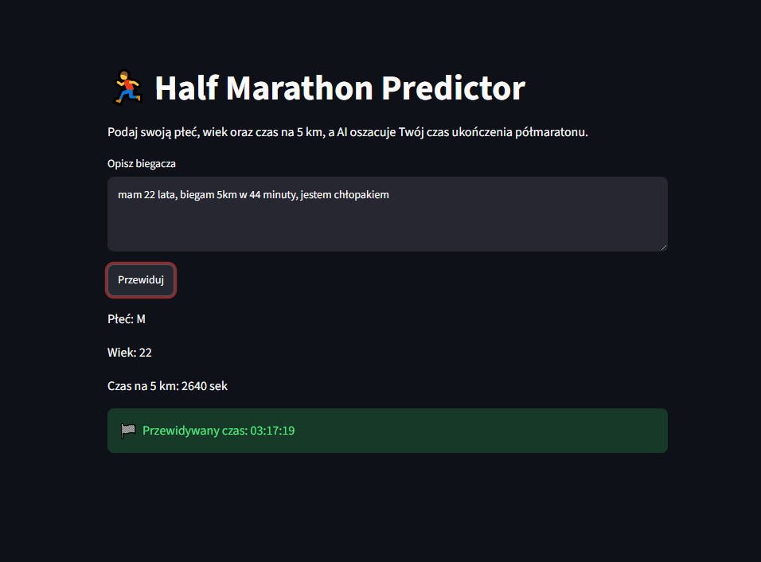
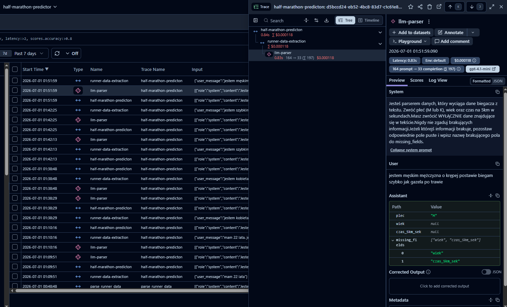

# 🏃 Half Marathon Predictor

AI-powered application that predicts half marathon finish time based on natural language input using a Machine Learning model and an LLM.

## 🚀 Live Demo

https://half-marathon-predictor.streamlit.app/

The application allows users to describe a runner in natural language and receive an estimated half marathon finish time based on their age, gender, and 5 km performance.

## 📸 Screenshots

### Main Application

The main screen allows users to describe a runner using natural language and request a half marathon time prediction.



### LLM Monitoring

Langfuse is used to monitor the LLM-based data extraction process and provide visibility into individual interactions.



## 📌 Project Overview

Half Marathon Predictor combines a Large Language Model with a Machine Learning regression model to create an end-to-end prediction workflow.

The user does not need to provide structured form data. Instead, they can describe their running profile in natural language, for example:

> I am a 28-year-old male and my 5 km time is 22 minutes.

The application uses OpenAI GPT-4.1 Mini to extract the required runner information into a structured Pydantic model. The extracted data is then passed to a trained regression model, which predicts the runner's expected half marathon finish time.

The project also integrates Langfuse to provide observability into the LLM interaction.

## ✨ Features

- Predict half marathon finish time
- Accept natural language input
- Extract runner information using GPT-4.1 Mini
- Convert free-form text into structured data
- Validate missing runner information
- Use a trained regression model for prediction
- Cache the loaded Machine Learning model with Streamlit
- Monitor LLM interactions with Langfuse
- Deploy the application using Streamlit Community Cloud

## 🛠 Tech Stack

- Python 3.11
- Streamlit
- Scikit-learn
- Pandas
- NumPy
- Joblib
- OpenAI API
- Instructor
- Pydantic
- Langfuse

## 🏛 Architecture

The application combines an LLM-based data extraction layer with a Machine Learning prediction layer.

```text
                    User
                      │
                      ▼
             Streamlit Application
                      │
                      ▼
          OpenAI GPT-4.1 Mini
                 + Instructor
                      │
                      ▼
          Structured Runner Data
                 (Pydantic)
                      │
                      ▼
             Regression Model
                      │
                      ▼
        Half Marathon Prediction
```

### UI Layer

Streamlit provides the user interface and handles:

- Natural language input
- Validation messages
- Prediction requests
- Displaying the final result

### LLM Layer

OpenAI GPT-4.1 Mini is used to extract structured information from the user's natural language description.

The extracted fields are:

- Gender
- Age
- 5 km time

Instructor and Pydantic are used to produce and validate structured output.

### Machine Learning Layer

The application uses a trained regression model to predict the expected half marathon finish time based on the extracted runner information.

The trained model is stored locally in the repository:

```text
models/halfmarathon_linear_regression.pkl
```

The model is loaded using Joblib and cached with Streamlit's `st.cache_resource`.

### Observability Layer

Langfuse provides monitoring for the LLM interaction, allowing the application to record traces and inspect the data extraction process.

## 📁 Project Structure

```text
half_marathon_predictor/
│
├── app.py
├── llm.py
├── predictor.py
├── utils.py
├── langfuse_client.py
├── requirements.txt
│
├── data/
│   ├── halfmarathon_wroclaw_2023_final.csv
│   └── halfmarathon_wroclaw_2024_final.csv
│
├── models/
│   └── halfmarathon_linear_regression.pkl
│
├── screenshots/
│   ├── app.png
│   └── langfuse.png
│
├── half_marathon_predictor.ipynb
├── .gitignore
└── README.md
```

### Main Components

- `app.py` — Streamlit application and user interface
- `llm.py` — LLM-based runner data extraction
- `predictor.py` — Loading the trained Machine Learning model
- `utils.py` — Prediction and time conversion utilities
- `langfuse_client.py` — Langfuse configuration
- `half_marathon_predictor.ipynb` — Machine Learning development and analysis
- `models/` — trained regression model
- `data/` — source race datasets
- `screenshots/` — application screenshots

## ⚙️ How It Works

1. The user enters a natural language description of the runner.
2. The application sends the text to GPT-4.1 Mini.
3. Instructor converts the response into the structured `RunnerData` Pydantic model.
4. The application checks whether any required information is missing.
5. The extracted runner data is passed to the regression model.
6. The model predicts the expected half marathon finish time.
7. The result is converted into a readable time format.
8. The prediction is displayed in the Streamlit interface.
9. The LLM interaction is monitored through Langfuse.

## 📄 Example Workflow

### Complete Input

Input:

> I am a 28-year-old male and my 5 km time is 22 minutes.

The LLM extracts:

```text
Gender: M
Age: 28
5 km time: 1320 seconds
```

The structured data is passed to the regression model, which returns the predicted half marathon finish time.

### Missing Information

Input:

> I am a 28-year-old male.

The application identifies the missing information and asks the user to provide:

```text
- 5 km time
```

No prediction is performed until all required information is available.

## 📊 LLM Monitoring

The application integrates Langfuse to provide observability into the LLM-based extraction process.

The monitoring layer records information about individual LLM interactions, including:

- Input messages
- LLM generations
- Model information
- Execution traces

This makes it possible to inspect and evaluate the LLM component independently from the Machine Learning prediction layer.

## 🚀 Installation

Clone the repository:

```bash
git clone https://github.com/Goldmanski/half_marathon_predictor.git
cd half_marathon_predictor
```

Create a virtual environment:

```bash
python -m venv .venv
```

### Windows

```bash
.venv\Scripts\activate
```

### Linux / macOS

```bash
source .venv/bin/activate
```

Install dependencies:

```bash
pip install -r requirements.txt
```

## 🔐 Environment Variables

The application requires API credentials for OpenAI and Langfuse.

Create a `.env` file locally and provide the required configuration:

```env
OPENAI_API_KEY=your_openai_api_key

LANGFUSE_PUBLIC_KEY=your_langfuse_public_key
LANGFUSE_SECRET_KEY=your_langfuse_secret_key
LANGFUSE_BASE_URL=your_langfuse_base_url
```

Do not commit `.env` to the repository.

When deployed using Streamlit Community Cloud, these values are provided through Streamlit Secrets.

## ▶️ Run

Start the application with:

```bash
streamlit run app.py
```

The application will be available locally through the Streamlit interface.

## ☁️ Deployment

The application is deployed using Streamlit Community Cloud.

The trained Machine Learning model is included directly in the GitHub repository and loaded locally by the application.

Sensitive configuration such as API keys is provided through Streamlit Community Cloud Secrets and is not stored in the repository.

## 🎯 Design Goals

The project focuses on combining several components into a simple end-to-end AI application:

- Natural language interaction
- Structured LLM outputs
- Machine Learning prediction
- Model serving
- LLM observability
- Simple web-based user interface
- Cloud deployment

The goal is to demonstrate how an LLM can act as a structured data extraction layer in front of a traditional Machine Learning model.

## 🔮 Possible Future Improvements

- Support additional race distances
- Compare multiple prediction models
- Store prediction history
- Add user authentication
- Provide a REST API
- Improve prediction accuracy with additional runner features
- Add more comprehensive model evaluation
- Expand the LLM extraction layer to support additional input formats

## 👤 Author

Created by Eliasz Nowicki as a portfolio project focused on Machine Learning, LLM integration, AI Engineering, and deployment.